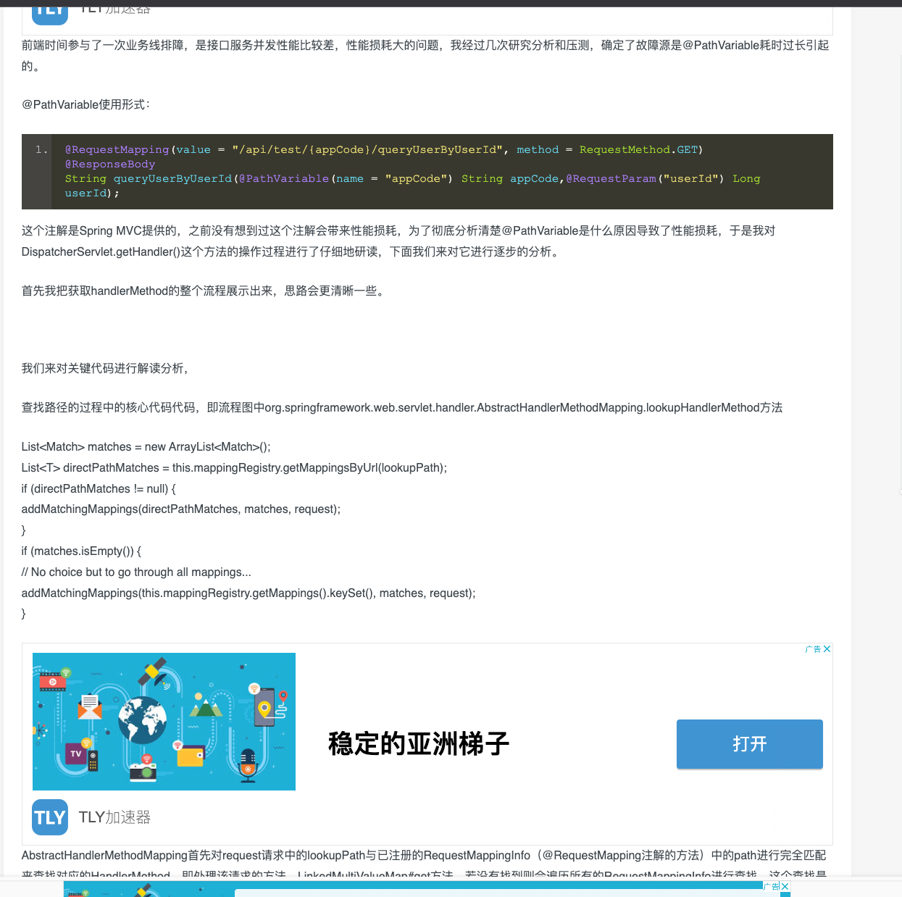

id: 202006231110
title: 性能优化
date: 2021-01-23 09:12:08
tags: "java开发"
categories: 性能
---------

* spring mvc transactional导致性能瓶颈

* 华为云redis带宽限制

* spring actuator至性能瓶颈(https://www.shuzhiduo.com/A/rV57PbN9dP/)

* 优化项：tomcat进行并发配置

* hystrix信号量配置减少CPU上下文切换

